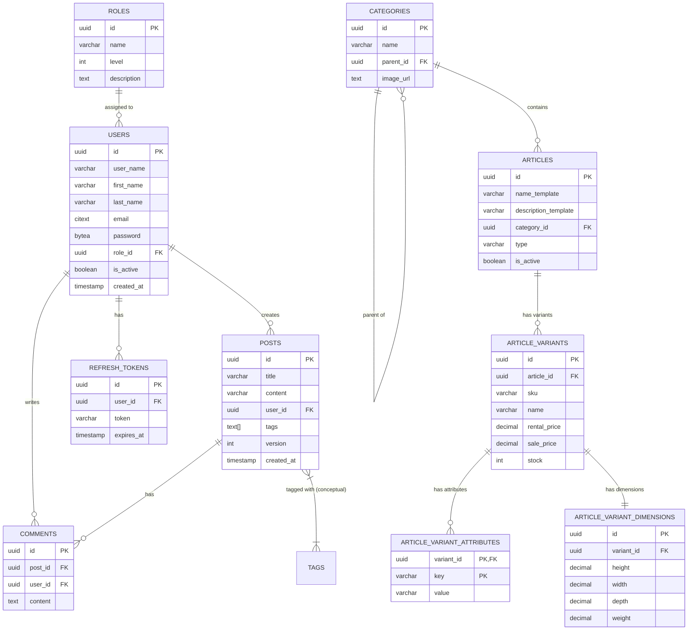

# Database Schema

This document represents the current state of the PostgreSQL database schema.

## Entity Relationship Diagram

## Tables Detail

### Users & Auth
- **users**: Core user identity. `email` is case-insensitive (CITEXT). `role_id` links to RBAC.
- **roles**: RBAC roles (Admin, Moderator, User).
- **refresh_tokens**: Long-lived JWT refresh tokens.

### Social
- **posts**: User content. Supports optimistic locking via `version`.
- **comments**: Responses to posts.

### Catalog (E-commerce)
- **categories**: Hierarchical category tree (Adjacency List pattern via `parent_id`).
- **articles**: Base product definition (e.g., "T-Shirt"). Holds shared data like Description Template.
- **article_variants**: Sellable SKUs (e.g., "Red T-Shirt Size L"). Holds Prices and Inventory.
- **article_variant_attributes**: EAV-lite for variant specifics (Color=Red, Size=L).
- **article_variant_dimensions**: Physical dimensions for shipping/logistics.
