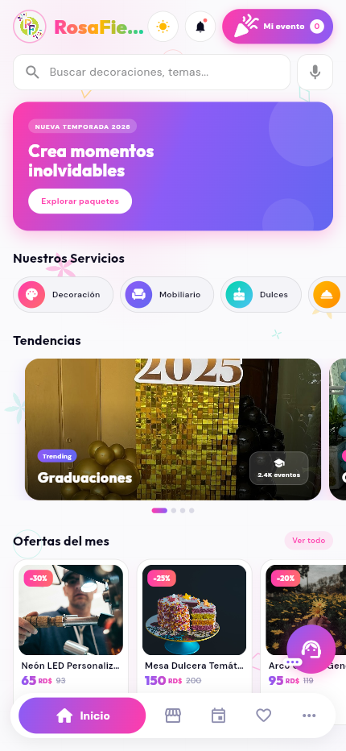

# Home, Mi Evento & AI Assistant UI Review — 2026-04-13

## Summary
- **Home "Mi evento" button**: notification pulse dot added with `TweenAnimationBuilder` — coral dot pulses gently when items > 0, positioned top-right of the celebration icon
- **AI Assistant Guided Flow**: overlay with pulsing rings and tooltip cards at first open showing users where to tap (event grid first, then bottom bar), auto-advances every 3s, dismisses on first user interaction

## Screenshots

### Home Screen

## Design Decisions

### "Mi evento" notification dot (home_screen.dart)
- Coral (`AppColors.coral`) pulsing dot via `TweenAnimationBuilder` (900ms `easeInOut`)
- `Positioned(right: -4, top: -4)` overlaps icon corner, matching cart notification pattern
- Only renders when `active.itemCount > 0`
- Icon wrapped in `Stack` with `_notificationPulse(t)` child

### AI Assistant guide overlay (assistant_screen.dart)
- Dark scrim (`Colors.black.withOpacity(0.35)`) dims full screen
- `_pulseController` (1200ms) animates ring scale 0.8→1.2 and opacity 0.5→0.9
- Tooltip card with touch icon, step text, and dot progress indicator
- Auto-advances from step 0 (event grid) → step 1 (bottom bar) every 3s, then auto-dismisses
- `_onUserEngage()` called on every tapable element — dismisses overlay on first interaction
- `_hasEngaged` flag ensures guide only shows on first open per session
- Guide starts automatically 800ms after screen opens

## Notes
- 54 info-level deprecation warnings (`withOpacity`) — no errors
- `_buildProductCards` is unused — pre-existing, not introduced in this session
- Cart reference app structure was: gradient pill + notification dot + badge count — all applied to "Mi evento"
