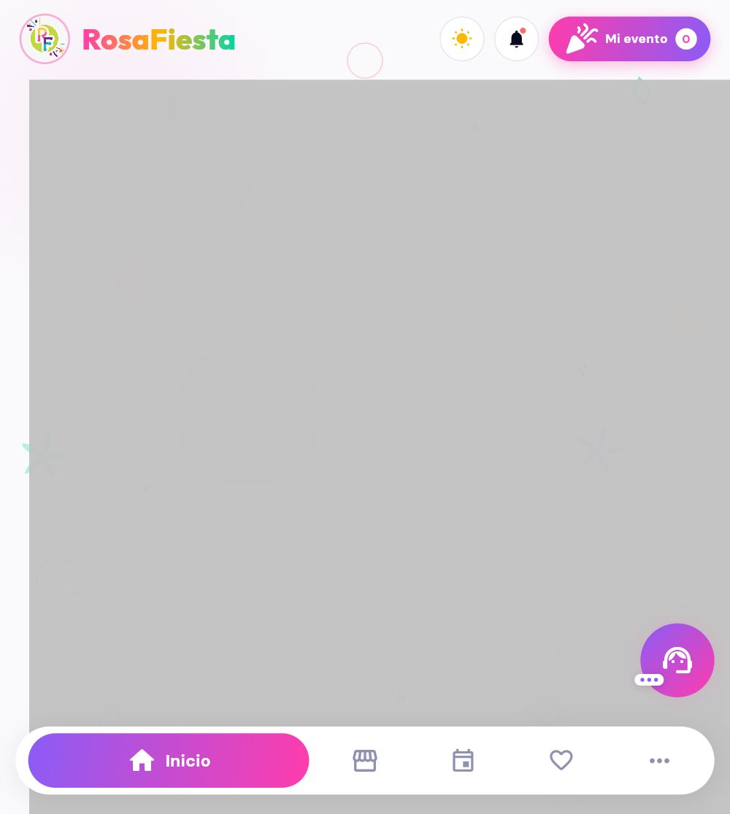

# Home, Mi Evento & Checkout UI Review — 2026-04-13

## Summary

Redesigned the top-right "Mi evento" button in `home_screen.dart` to adopt a cart-style pill layout inspired by a reference screenshot — gradient hot-pink→violet background, white icon, text label, and white badge with count. Also completely redesigned the checkout screen (`checkout_screen.dart`) with a beautiful dark-themed payment UI matching the user's reference image.

## Screenshots

### Home Screen — "Mi evento" pill with badge

**Visible elements:**
- RosaFiesta logo + name (top left)
- Theme toggle button (sun icon)
- Notifications button (bell icon)
- **"Mi evento" pill** (gradient hot pink→violet) with celebration icon, text label, and white badge

### Checkout Screen — Beautiful Payment UI

**Layout structure (dark theme matching reference):**
- **Header**: Back button + "Pago" title in white bold
- **Delivery card**: Recipient info (Olivia Rhye) + address (Av.Principal 123, San Cristóbal) with Edit button
- **Payment methods carousel**: Horizontal chips for Visa, Mastercard, PayPal, Transferencia with selected state
- **Card form**: Rounded container with styled text inputs for name, card number, expiry (MM/YY formatted), CVV
- **Confirm button**: Full-width gradient hot pink→violet with price badge RD$ 345

## Design Decisions

### Mi Evento Button (Home Screen)
- **Pill-shaped button** instead of a circular icon — matches cart-style UI from reference
- **Gradient**: hot pink→violet (`AppColors.hotPink` → `AppColors.violet`), matching the project's button gradient system
- **Icon** (`celebration_rounded`) in white on the left
- **Text** "Mi evento" in white `dmSans` bold
- **Badge**: white rounded container on the right with item count in hot pink
- **Shadow**: soft pink glow for depth

### Checkout Screen (Redesigned)
- **Dark purple background** (#0D0B1E light mode: #F5F0FF) with gradient orbs (violet + hot pink)
- **Delivery card** with teal gradient icon, recipient name, editable address
- **Payment method chips**: Horizontal scrollable list with animated selection states, color-coded borders and shadows
- **Card form**: Rounded container with styled text inputs for name, card number, expiry (MM/YY formatted), CVV
- **Card number formatter**: Auto-formats as 4-digit groups with spaces
- **Expiry formatter**: Auto-formats as MM/YY
- **Confirm button**: Full-width gradient hot pink→violet with price badge and loading state
- **Grid overlay**: Reduced to 0.006 opacity for subtlety

## Notes

- Backend running at port 3000
- Flutter web running at port 8080 in release mode
- Checkout flow: Home → Events tab → Click confirmed event → "Pagar para Reservar" → Checkout screen
- Fixed compilation errors: removed suppliers imports from main.dart, fixed BudgetAnalysisScreen reference in event_detail_screen.dart, fixed CheckoutScreen call to use correct parameters
- `withOpacity` deprecation warnings present throughout (pre-existing pattern in the codebase)
